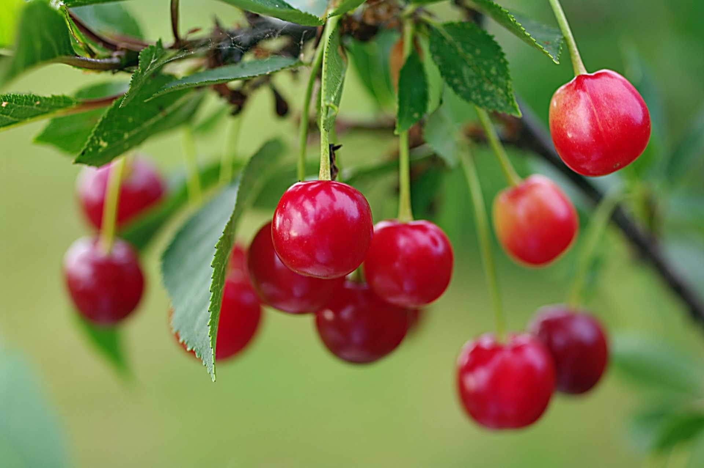
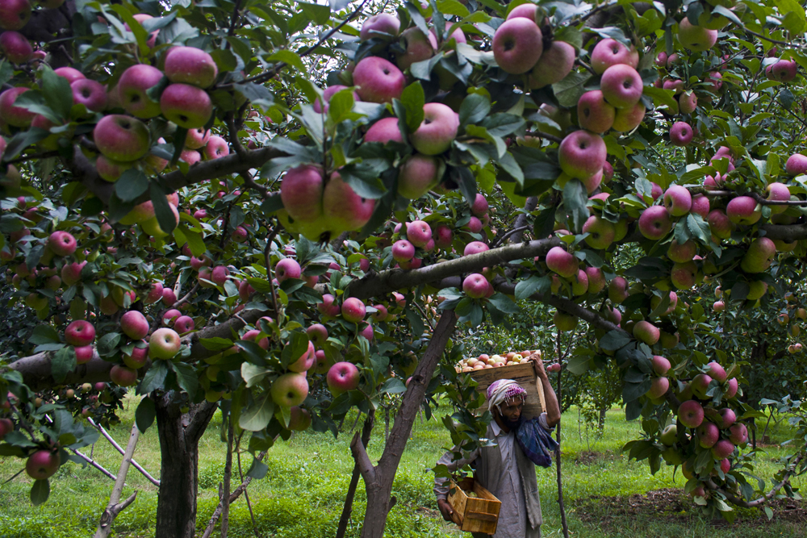

Here's the `README.md` file for your ODOP (One District One Product) project:

```markdown
# ODOP - One District One Product

This project is a web page dedicated to showcasing various products from the Jammu and Kashmir region as part of the One District One Product (ODOP) initiative. It includes information about fruits, other products, and spices from the region, along with a navigation menu, an image slider, and a footer with useful links.

## Features

- Navigation bar with links to Home, About, Contact Us, and Government Schemes pages.
- A search bar with a Sign-in link.
- An animated image slider showcasing various products.
- Detailed information about various fruits, products, and spices from Jammu and Kashmir.
- A footer with quick links, important websites, and social media links.

## Requirements

- A modern web browser with internet access.
- Basic knowledge of HTML and CSS for any modifications.

## Usage

1. **Clone the Repository**:
    ```bash
    git clone https://github.com/raginee_darade/odop.git
    cd odop
    ```

2. **Open the main HTML file**:
    Open `index.html` in your preferred web browser to view the webpage.

## File Structure

- `index.html`: The main HTML file containing the structure of the webpage.
- `style.css`: Contains the CSS styles for the webpage.
- Image files: Ensure you have the following image files in the same directory:
  - `odop.png`
  - `apple.png`
  - `honey.jpeg`
  - `saffon.jpeg`
  - `spices.webp`
  - `cherry.jpg`
  - `mashroom.jpeg`
  - `wallnut.jpg`
  - `lav.jpeg`
  - `garlic.jpeg`
  - `mirchi.jpeg`
  - `s.jpg`

## HTML Code Overview

1. **Header and Navigation Bar**:
    ```html
    <header>
        <nav class="navbar">
            <ul>
                <li><a href="h.html">Home</a></li>
                <li><a href="About.html">About</a></li>
                <li><a href="Contact.html">Contact Us</a></li>
                <li><a href="Gov.html">Gov Schemes</a></li>
                <div class="search">
                    <a href="sign.html">Sign_in</a>
                </div>
            </ul>
        </nav>
    </header>
    ```

2. **Image Slider**:
    ```html
    <div class="slider"></div>
    ```

3. **Product Information Sections**:
    ```html
    <div class="fruit">
        <h1>Fruits Product in Jammu and Kashmir</h1>
        
        
        
        <p>Details about products...</p>
    </div>
    ```

4. **Footer**:
    ```html
    <footer>
        <div class="footer-container">
            <div class="footer-links">
                <h3>Quick Links</h3>
                <ul>
                    <li><a href="h.html">Home</a></li>
                    <li><a href="About.html">About</a></li>
                    <li><a href="Contact.html">Contact Us</a></li>
                    <li><a href="sign.html">Sign_in</a></li>
                    <li><a href="Gov.html">Gov Info</a></li>
                </ul>
            </div>
            <div class="footer-links">
                <h3>_______</h3>
                <ul>
                    <li><a href="https://odop.mofpi.gov.in/">GIS Portal</a></li>
                    <li><a href="https://www.investindia.gov.in/">Invest India</a></li>
                    <li><a href="https://www.india.gov.in/">National Portal</a></li>
                    <li><a href="https://instapdf.in/one-district-one-product-list/">Product List</a></li>
                </ul>
            </div>
            <div class="footer-social">
                <h3>Follow Us</h3>
                <ul>
                    <li><a href="https://facebook.com">Facebook</a></li>
                    <li><a href="https://twitter.com/RagineeDarade">Twitter</a></li>
                    <li><a href="https://instagram.com/raginee_darade">Instagram</a></li>
                    <li><a href="https://linkedin.com/The Raginee Darade">LinkedIn</a></li>
                </ul>
            </div>
        </div>
        <div class="footer-bottom">
            <h4 class="coppy">Copyright ©2024 ODOP.COM (P) Ltd.</h4>
        </div>
    </footer>
    ```

## Contributing

Contributions are welcome! Please open an issue or submit a pull request on GitHub.

## License

This project is licensed under the MIT License. See the [LICENSE](LICENSE) file for details.

## Contact

For any inquiries, you can contact the developer through the following links:

- [Facebook](https://facebook.com)
- [Twitter](https://twitter.com/RagineeDarade)
- [Instagram](https://instagram.com/raginee_darade)
- [LinkedIn](https://linkedin.com/The Raginee Darade)

---

 
```

 
